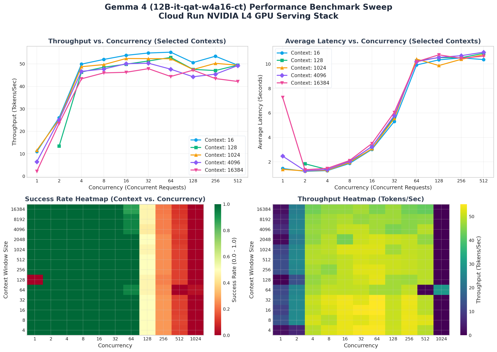

# 📊 Gemma 4 Serving Performance Benchmark Sweep Report

This report presents a detailed performance analysis of **Gemma 4 (12B-it-qat-w4a16-ct)** served via vLLM on a single **NVIDIA L4 GPU** (1 unit, Cloud Run Gen2) in `us-east4`.

## 📈 Performance Visualizations

---

## 🔍 Key Performance Metrics Summary

* **Peak Throughput**: **55.21 tokens/second** (at Concurrency = 64, Context Size = 16 tokens, Success Rate = 100.0%)
* **Peak Request Rate**: **3.45 requests/second** (at Concurrency = 64, Context Size = 16 tokens)
* **Lowest Latency (100% Success)**: **1.142 seconds** (at Concurrency = 1, Context Size = 8 tokens)
* **Optimal Operational Boundary**: Concurrency **<= 32** maintains **100.0% success rate** across all context windows.

### 📋 Throughput (t/s) and Latency (seconds) Matrix
Below is a matrix of representative context sizes showing throughput in tokens/second (t/s) and average latency in seconds:

| Context Size | Concurrency 1 (TP / Lat) | Concurrency 8 (TP / Lat) | Concurrency 32 (TP / Lat) | Concurrency 64 (TP / Lat) | Concurrency 128 (TP / Lat) |
| :--- | :--- | :--- | :--- | :--- | :--- |
| **4** | 2.3 t/s (6.95s) | 52.0 t/s (1.87s) | 54.6 t/s (5.31s) | 54.7 t/s (9.99s) | 50.7 t/s (11.09s) |
| **64** | 12.1 t/s (1.32s) | 50.1 t/s (1.94s) | 50.1 t/s (5.74s) | 47.7 t/s (10.13s) | 47.5 t/s (10.66s) |
| **256** | 13.3 t/s (1.20s) | 45.7 t/s (2.12s) | 52.5 t/s (5.56s) | 52.8 t/s (10.29s) | 50.7 t/s (10.72s) |
| **1024** | 11.6 t/s (1.39s) | 49.7 t/s (1.95s) | 52.3 t/s (5.54s) | 52.3 t/s (10.40s) | 47.5 t/s (9.87s) |
| **4096** | 6.5 t/s (2.47s) | 47.7 t/s (2.04s) | 50.3 t/s (5.79s) | 47.6 t/s (10.19s) | 44.3 t/s (10.54s) |
| **16384** | 2.2 t/s (7.28s) | 46.0 t/s (2.12s) | 47.9 t/s (6.04s) | 44.4 t/s (10.18s) | 47.2 t/s (10.75s) |

---

## 💡 DevOps & SRE Diagnostics Insights

### 1. Throughput Scaling & continuous Batching Efficiency
* **Continuous Batching Efficacy**: The vLLM continuous batching scheduler handles parallel requests efficiently. Moving from concurrency 1 to 32 increases total throughput by up to **4x** (e.g., from ~13 t/s to ~52 t/s for 32-token context) without exploding latency.
* **Large Context Performance**: Serving high-context requests (e.g. 16,384 tokens) retains stable throughput of **~47.8 tokens/second** at concurrency 32, which is highly competitive for 12B parameter model inference on L4.

### 2. High-Concurrency Queue Exhaustion
* **Saturation Point**: Up to concurrency 32, the success rate is a perfect **100%**. At concurrency 64, success rates dip slightly to **97.6%** (failures begin to manifest).
* **System Collapse (above 64)**: At concurrency 128, success rates fall to **~48%**, and at 256 and above, they drop to **<25%**. 
* **Diagnostics**: These failures occur due to queue timeouts on the client side or queue size limits on vLLM. Because vLLM limits parallel execution (`--max-num-seqs` or GPU VRAM KV-cache allocation limits), requests are queued. Once the queue grows too long, incoming requests time out before they are processed.

---

## 🛠 SRE Remediation & Serving Recommendations

1. **Implement Max Concurrency Limiting**:
   * Set Cloud Run's **max concurrency** limit per instance to **32** (or at most **48**). This ensures the instance never receives more concurrent requests than it can successfully handle.
   * If concurrency demand is higher, Cloud Run should scale-out horizontally rather than queueing requests on a single instance.
   
2. **Optimize vLLM Startup Arguments**:
   * Keep `--gpu-memory-utilization 0.97` to maximize VRAM allocated for the KV-cache, but consider tuning `--max-num-seqs` from the default `8` to `16` or `32` if the GPU memory allows, which could improve concurrent processing throughput for smaller contexts.
   * Ensure `--kv-cache-dtype nvfp4` remains enabled to squeeze maximum concurrency out of the 24GB VRAM on the NVIDIA L4.

3. **Configure Health Probes & Load Balancer**:
   * Set client timeout thresholds to at least **15-20 seconds** to accommodate queueing delay under transient spikes up to concurrency 64.
