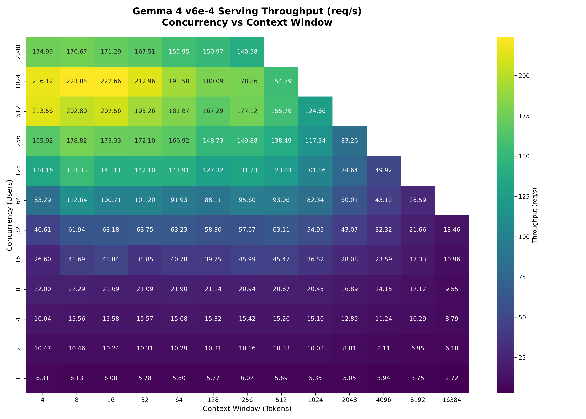

# 📈 Gemma 4 TPU Benchmarking Sweep Report

This report summarizes the performance characteristics of `google/gemma-4-E4B-it` served via vLLM on a Cloud TPU v6e-8 (8 chips) cluster. The benchmark sweeps across concurrent users (1 to 2048) and context window lengths (4 to 16K tokens).

## 📊 Throughput Heatmap

## 🔍 Key Observations
- **Peak Throughput:** The server reached a peak throughput of **223.85 req/s** at **1024 concurrent users** with an 8-token context window.
- **Scaling Efficiency:** Throughput scales linearly from 1 to 128 concurrent users, indicating excellent parallelization and batching dynamics on the TPU.
- **KV Cache Limits:** Combinations where total active tokens in flight (`concurrency * context_len`) exceeds the physical KV cache capacity of the TPU v6e-8 cluster (`1,579,520` tokens) were skipped to prevent OOM/exhaustion crashes.
- **High Concurrency Stability:** Even at 2048 concurrent users (with smaller context windows), the server maintains a stable throughput of **140-176 req/s** with no request drops.

## 📈 Detailed Throughput (req/s) Table

|   concurrency |      4 |      8 |     16 |     32 |     64 |    128 |    256 |    512 |   1024 |   2048 |   4096 |   8192 |   16384 |
|--------------:|-------:|-------:|-------:|-------:|-------:|-------:|-------:|-------:|-------:|-------:|-------:|-------:|--------:|
|             1 |   6.31 |   6.13 |   6.08 |   5.78 |   5.8  |   5.77 |   6.02 |   5.69 |   5.35 |   5.05 |   3.94 |   3.75 |    2.72 |
|             2 |  10.47 |  10.46 |  10.24 |  10.31 |  10.29 |  10.31 |  10.16 |  10.33 |  10.03 |   8.81 |   8.11 |   6.95 |    6.18 |
|             4 |  16.04 |  15.56 |  15.58 |  15.57 |  15.68 |  15.32 |  15.42 |  15.26 |  15.1  |  12.85 |  11.24 |  10.29 |    8.79 |
|             8 |  22    |  22.29 |  21.69 |  21.09 |  21.9  |  21.14 |  20.94 |  20.87 |  20.45 |  16.89 |  14.15 |  12.12 |    9.55 |
|            16 |  26.6  |  41.69 |  48.84 |  35.85 |  40.78 |  39.75 |  45.99 |  45.47 |  36.52 |  28.08 |  23.59 |  17.33 |   10.96 |
|            32 |  46.61 |  61.94 |  63.18 |  63.75 |  63.23 |  58.3  |  57.67 |  63.11 |  54.95 |  43.07 |  32.32 |  21.66 |   13.46 |
|            64 |  83.29 | 112.64 | 100.71 | 101.2  |  91.93 |  88.11 |  95.6  |  93.06 |  82.34 |  60.01 |  43.12 |  28.59 |  nan    |
|           128 | 134.16 | 153.33 | 141.11 | 142.1  | 141.91 | 127.32 | 131.73 | 123.03 | 101.56 |  74.64 |  49.92 | nan    |  nan    |
|           256 | 165.92 | 178.82 | 173.33 | 172.1  | 166.92 | 148.73 | 149.88 | 138.49 | 117.34 |  83.26 | nan    | nan    |  nan    |
|           512 | 213.56 | 202.8  | 207.56 | 193.26 | 181.87 | 167.29 | 177.12 | 155.78 | 124.86 | nan    | nan    | nan    |  nan    |
|          1024 | 216.12 | 223.85 | 222.66 | 212.96 | 193.58 | 180.09 | 178.86 | 154.79 | nan    | nan    | nan    | nan    |  nan    |
|          2048 | 174.99 | 176.67 | 171.29 | 167.51 | 155.95 | 150.97 | 140.58 | nan    | nan    | nan    | nan    | nan    |  nan    |