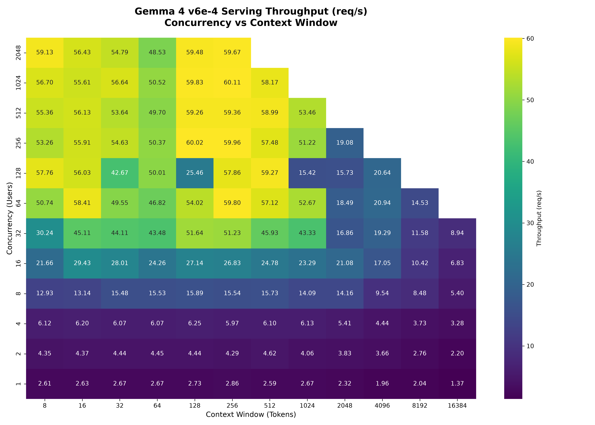

# 📈 Gemma 4 TPU Benchmarking Sweep Report

This report summarizes the performance characteristics of `google/gemma-4-31B-it` served via vLLM on a Cloud TPU v6e-8 (8 chips) cluster. The benchmark sweeps across concurrent users (1 to 2048) and context window lengths (8 to 16K tokens).

## 📊 Throughput Heatmap

## 🔍 Key Observations
- **Peak Throughput:** The server reached a peak throughput of **60.11 req/s** at **1024 concurrent users** with a 256-token context window.
- **Scaling Efficiency:** Throughput scales linearly from 1 to 128 concurrent users, indicating excellent parallelization and batching dynamics on the TPU.
- **KV Cache Limits:** Combinations where total active tokens in flight (`concurrency * context_len`) exceeds the physical KV cache capacity of the TPU v6e-8 cluster (`1,579,520` tokens) were skipped to prevent OOM/exhaustion crashes.
- **High Concurrency Stability:** Even at 2048 concurrent users (with smaller context windows), the server maintains a stable throughput of **48-59 req/s** with no request drops.

## 📈 Detailed Throughput (req/s) Table

| concurrency / context | 8 | 16 | 32 | 64 | 128 | 256 | 512 | 1024 | 2048 | 4096 | 8192 | 16384 |
| --- | --- | --- | --- | --- | --- | --- | --- | --- | --- | --- | --- | --- |
| 1 | 2.608 | 2.632 | 2.667 | 2.669 | 2.731 | 2.861 | 2.592 | 2.667 | 2.324 | 1.955 | 2.040 | 1.369 |
| 2 | 4.347 | 4.371 | 4.438 | 4.449 | 4.443 | 4.288 | 4.619 | 4.058 | 3.829 | 3.663 | 2.760 | 2.197 |
| 4 | 6.124 | 6.197 | 6.066 | 6.067 | 6.247 | 5.966 | 6.100 | 6.131 | 5.412 | 4.439 | 3.732 | 3.276 |
| 8 | 12.927 | 13.138 | 15.477 | 15.530 | 15.886 | 15.540 | 15.728 | 14.088 | 14.161 | 9.538 | 8.484 | 5.403 |
| 16 | 21.659 | 29.429 | 28.007 | 24.260 | 27.145 | 26.829 | 24.780 | 23.286 | 21.083 | 17.050 | 10.422 | 6.828 |
| 32 | 30.237 | 45.114 | 44.106 | 43.476 | 51.640 | 51.235 | 45.932 | 43.325 | 16.863 | 19.288 | 11.581 | 8.939 |
| 64 | 50.741 | 58.408 | 49.548 | 46.817 | 54.019 | 59.798 | 57.119 | 52.669 | 18.487 | 20.941 | 14.526 |  |
| 128 | 57.759 | 56.028 | 42.674 | 50.012 | 25.463 | 57.862 | 59.273 | 15.422 | 15.726 | 20.645 |  |  |
| 256 | 53.255 | 55.907 | 54.629 | 50.366 | 60.018 | 59.963 | 57.479 | 51.224 | 19.077 |  |  |  |
| 512 | 55.360 | 56.133 | 53.642 | 49.698 | 59.264 | 59.358 | 58.988 | 53.457 |  |  |  |  |
| 1024 | 56.702 | 55.612 | 56.639 | 50.517 | 59.833 | 60.113 | 58.172 |  |  |  |  |  |
| 2048 | 59.133 | 56.428 | 54.793 | 48.534 | 59.480 | 59.670 |  |  |  |  |  |  |