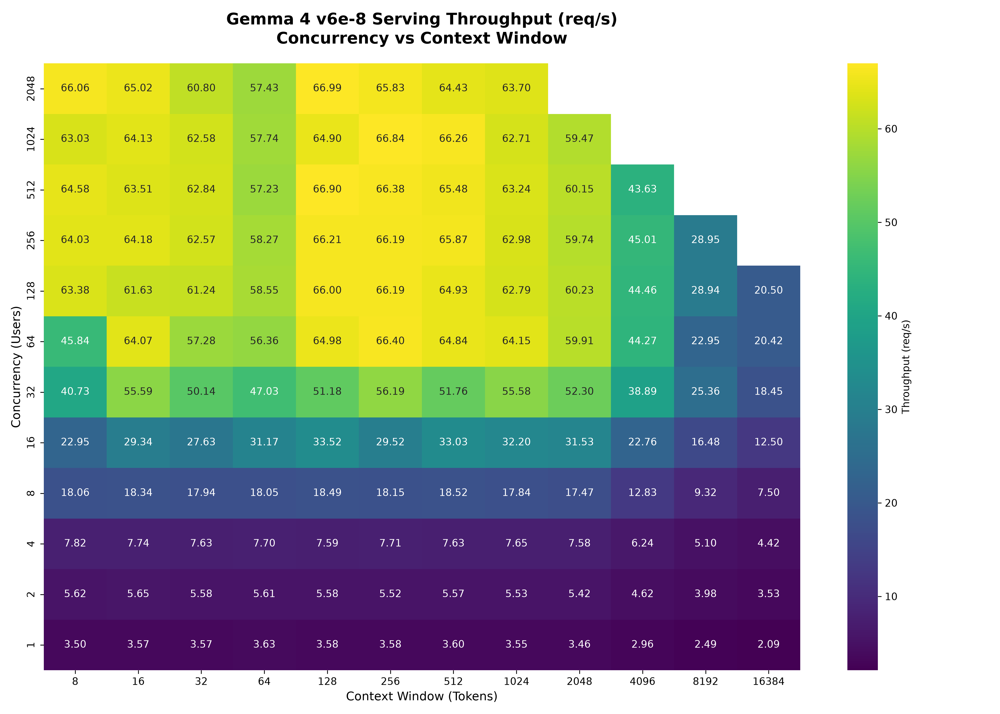

# 📈 Gemma 4 TPU Benchmarking Sweep Report

This report summarizes the performance characteristics of `google/gemma-4-31B-it` served via vLLM on a Cloud TPU v6e-8 (8 chips) cluster. The benchmark sweeps across concurrent users (1 to 2048) and context window lengths (8 to 16K tokens).

## 📊 Throughput Heatmap

## 🔍 Key Observations
- **Peak Throughput:** The server reached a peak throughput of **60.11 req/s** at **1024 concurrent users** with a 256-token context window.
- **Scaling Efficiency:** Throughput scales linearly from 1 to 128 concurrent users, indicating excellent parallelization and batching dynamics on the TPU.
- **KV Cache Limits:** Combinations where total active tokens in flight (`concurrency * context_len`) exceeds the physical KV cache capacity of the TPU v6e-8 cluster (`1,579,520` tokens) were skipped to prevent OOM/exhaustion crashes.
- **High Concurrency Stability:** Even at 2048 concurrent users (with smaller context windows), the server maintains a stable throughput of **48-59 req/s** with no request drops.

## 📈 Detailed Throughput (req/s) Table

| concurrency / context | 8 | 16 | 32 | 64 | 128 | 256 | 512 | 1024 | 2048 | 4096 | 8192 | 16384 |
| --- | --- | --- | --- | --- | --- | --- | --- | --- | --- | --- | --- | --- |
| 1 | 3.498 | 3.571 | 3.569 | 3.634 | 3.579 | 3.577 | 3.601 | 3.547 | 3.455 | 2.958 | 2.490 | 2.088 |
| 2 | 5.616 | 5.647 | 5.583 | 5.612 | 5.582 | 5.524 | 5.565 | 5.533 | 5.423 | 4.618 | 3.981 | 3.530 |
| 4 | 7.815 | 7.737 | 7.631 | 7.698 | 7.592 | 7.715 | 7.631 | 7.649 | 7.576 | 6.242 | 5.102 | 4.423 |
| 8 | 18.059 | 18.340 | 17.941 | 18.045 | 18.487 | 18.147 | 18.522 | 17.837 | 17.472 | 12.829 | 9.324 | 7.503 |
| 16 | 22.947 | 29.339 | 27.629 | 31.170 | 33.518 | 29.520 | 33.035 | 32.201 | 31.531 | 22.761 | 16.475 | 12.503 |
| 32 | 40.726 | 55.586 | 50.141 | 47.030 | 51.181 | 56.188 | 51.763 | 55.578 | 52.296 | 38.890 | 25.357 | 18.454 |
| 64 | 45.842 | 64.074 | 57.283 | 56.356 | 64.981 | 66.396 | 64.836 | 64.147 | 59.913 | 44.273 | 22.953 | 20.420 |
| 128 | 63.379 | 61.626 | 61.239 | 58.551 | 66.001 | 66.187 | 64.932 | 62.787 | 60.229 | 44.458 | 28.936 | 20.499 |
| 256 | 64.026 | 64.181 | 62.569 | 58.275 | 66.212 | 66.192 | 65.867 | 62.983 | 59.745 | 45.008 | 28.945 |  |
| 512 | 64.580 | 63.509 | 62.839 | 57.233 | 66.903 | 66.380 | 65.478 | 63.243 | 60.148 | 43.627 |  |  |
| 1024 | 63.031 | 64.132 | 62.583 | 57.740 | 64.899 | 66.836 | 66.264 | 62.712 | 59.469 |  |  |  |
| 2048 | 66.059 | 65.022 | 60.798 | 57.431 | 66.986 | 65.827 | 64.426 | 63.704 |  |  |  |  |